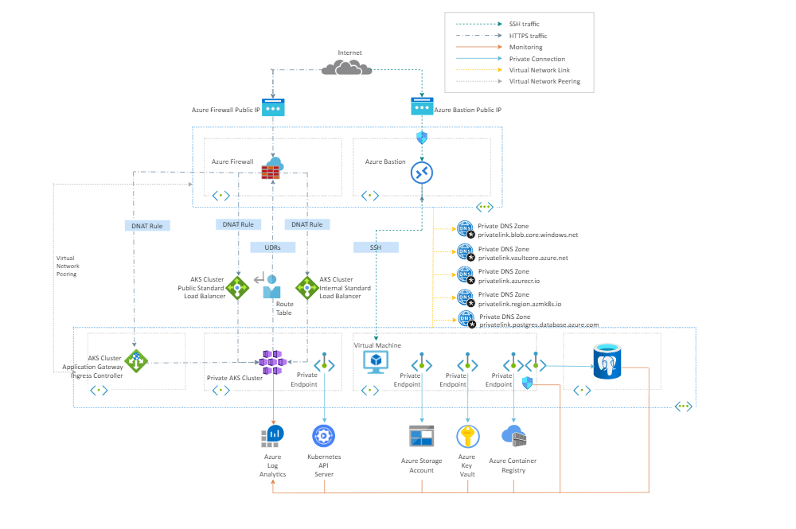

# ABC Repository for creating a private Azure Kubernetes Service Cluster for a UAE Clients

# Who is ABC?

ABC is one of the leading cloud consulting business and has assisted several companies worldwide to move into the cloud and DevOps space utilizing best practices from all top cloud providers from Microsoft Azure, Amazon, GCP and IBM.


# Who is our UAE Client?

UAE Client is an insurance company and long standing ABC customer,
having successfully integrated ABC engineering teams with
their own in-house cloud resources to execute on key initiatives,
tactical backlog execution and strategic cloud projects.
One of these key initiatives is establishing a managed container
platform service.

# Business Justification
UAE Client recognises that by adopting a multi-cloud strategy, to include
support for containerised applications, additional specialist cloud
platform skills will be required. They wish **ABC's Team** to help them
utilise containers as part of as an enabler for their overall DevOps
and Modernisation strategy.
As part of this strategy, the insurance company wishes to
have a cloud-hosted container orchestration platform solution in
place in order to support their vision of having a managed cluster
solution for their container infrastructure.

# Proposed Solution

ABC's team will assist to provision cloud based infrastructure to create a managed container solution using an Infrastructure as Code (Iac) approach.

The IaC solution should allow provisioning of one small orchestrated
cluster of containers from a managed container registry of your
choice. The solution should will Azure best practises in terms of security and hardening.  The solution will be provisioned in an isolated/private Azure network and allow load-balanced network connectivity. This solution willalso allow for automatic provisioning of a container from the managed container registry.

# Create a Private AKS Cluster

This repository provides you with Terraform codes to create a private Azure Kubernetes Service (AKS) Cluster. Ref: [private AKS clusters](https://docs.microsoft.com/en-us/azure/aks/private-clusters)

In this repository, we unitize terraform and Azure DevOps Pipeline.
- Terraformas infrastructure as code (IaC) tool to build, change, and version the infrastructure on Azure in a safe, repeatable, and efficient way. Ref: [Terraform](https://www.terraform.io/intro/index.html)

- Azure DevOps Pipelines to automate the deployment and undeployment of the entire infrastructure on multiple environments on the Azure platform. Ref:  [Azure DevOps Pipelines](https://docs.microsoft.com/en-us/azure/devops/pipelines/get-started/what-is-azure-pipelines?view=azure-devops)

The AKS infrastructure to be deployed is a private cluster, that is the control plane or API server has internal IP address that are defined in the  [RFC1918 - Address Allocation for Private Internet](https://tools.ietf.org/html/rfc1918) document. This simply mean the API server endpoint is not exposed via a public IP address. Hence, to manage the API server, you need a way to access the private API server securely.

Accessing a private AKS cluster requires that you connect to that cluster either from the cluster virtual network, from a peered network, or via a configured private endpoint. These approaches require configuring a VPN, Express Route, deploying a jumpbox within the cluster virtual network, or creating a private endpoint inside of another virtual network. Alternatively, you can use `command invoke` to access private clusters. Ref: [Access a private cluster remotely](https://docs.microsoft.com/en-us/azure/aks/command-invoke)

The most cost effective way is to manage the cluster via peering network or `command invoke`. However, the `command invoke` does not require certain infrastructure in place. Hence, our focus on peering network.

This has led us to choose a network layout of hub and spoke.  The hub virtual network acts as a central point of connectivity to many spoke virtual networks. The hub can also be used as the connectivity point to your on-premises networks. The spoke virtual networks peer with the hub and can be used to isolate workloads (Just perfect for our workload). Ref: [Hub-spoke network topology in Azure](https://docs.microsoft.com/en-us/azure/architecture/reference-architectures/hybrid-networking/hub-spoke?tabs=cli) 

In this repository, we have created several resouces in addition to private AKS cluster and Hub and spoke topology, such as
- Azure Container Registry
- Azure Key Vault
- Azure PostgreSQL
- Application Gateway as Ingress controller
- Private endpoints to all resouces to be utilized by AKS
- Bastion Host
- Azure Virtual Machine as Jumpbox
- Azure Firewall
- Azure Log Analytics
- Load Balancer
- and other managed resources.

# Infrastructure Architecture Diagram
The following picture shows the high-level architecture created by the Terraform modules included in this sample:




The architecture is composed of the following elements:

- A hub virtual network with two subnets:
  - AzureBastionSubnet used by Azure Bastion
  - AzureFirewallSubnet used by Azure Firewall
- A new virtual network with five subnets:
  - SystemSubnet used by the AKS system node pool
  - UserSubnet used by the AKS user node pool
  - VmSubnet used by the jumpbox virtual machine and private endpoints
  - PostgreSQL Subnet connected by a private endpoint to the AKS clsuter
  - Application Gateway Subnet as ingress controller.
- An Azure Firewall used to control the egress traffic from the private AKS cluster. For more information on how to lock down your private AKS cluster and filter outbound traffic, see: 
  - [Control egress traffic for cluster nodes in Azure Kubernetes Service (AKS)](https://docs.microsoft.com/en-us/azure/aks/limit-egress-traffic)
  - [Use Azure Firewall to protect Azure Kubernetes Service (AKS) Deployments](https://docs.microsoft.com/en-us/azure/firewall/protect-azure-kubernetes-service)
- An AKS cluster with a private endpoint to the API server hosted by an AKS-managed Azure subscription. The cluster can communicate with the API server exposed via a Private Link Service using a private endpoint and consist of a system nodes for deploying system critical resources and usernodes for deploying Application workloads.
- An [Azure Application Gateway](https://docs.microsoft.com/en-us/azure/application-gateway/overview) which is a regional, fully-managed load balancing service that can perform layer-7 routing and SSL termination. It also provides a Web Access Firewall and an [ingress controller](https://docs.microsoft.com/en-us/azure/application-gateway/ingress-controller-overview) for Kubernetes. For more information, see [Use Application Gateway Ingress Controller (AGIC) with a multi-tenant Azure Kubernetes Service](https://docs.microsoft.com/en-us/azure/architecture/example-scenario/aks-agic/aks-agic).
- An Azure Bastion resource that provides secure and seamless SSH connectivity to the Vm virtual machine directly in the Azure portal over SSL
- An Azure Container Registry (ACR) to build, store, and manage container images and artifacts in a private registry for all types of container deployments communicating via private endponit[Connect privately to an Azure container registry using Azure Private Link](https://docs.microsoft.com/en-us/azure/container-registry/container-registry-private-link).
- A jumpbox virtual machine used to manage the Azure Kubernetes Service cluster
- An Azure Key Vault for storing secrets and certificates.
- A Private DNS Zone for the name resolution of each private endpoint.
- A Virtual Network Link between each Private DNS Zone and both the hub and spoke virtual networks
- A Log Analytics workspace to collect the diagnostics logs and metrics of both the AKS cluster and Vm virtual machine.

# Infrastructure Deployment

The terraform codes could be used to deploy the infrastructure in numerous ways. However, we highlight two tested methods for infrastructure deployment.
- Local terminal
- Azure DevOps Pipeline.

**Local terminal** approach is quite a straight forward and the following hightlights steps to achieve deployment of the Azure Infrastructure on your local terminal.
- [install az cli](https://docs.microsoft.com/en-us/cli/azure/install-azure-cli)
- [Install Terraform](https://learn.hashicorp.com/tutorials/terraform/install-cli)
- [Create a service principal](https://docs.microsoft.com/en-us/azure/developer/terraform/authenticate-to-azure?tabs=bash#create-a-service-principal). Ensure the owner role is assigned to the SP as it is needed to assign other roles to some managed identities. This should output the service client id and secret. (This is needed for the next stage) 
```
az ad sp create-for-rbac --scopes /subscriptions/subscription-ID --name sp-name  --role owner
```
- In the provider.tf file in prods/prod folder, comment lines 10-15 as this is may not be needed (else you have storage account created and wants your state file in Azure blob).
- In the same file, uncomment lines 21-24 and replace the "xxxxx" with the right values including the client id and secret gotten when created service principal
- Goto the prods/prod folder and run `terraform init` to initialize the folder with require modules.
- run `terraform apply prod.tfplan` to plan the infrastructure and save the plan to prod.tfplan.
- run `terraform apply prod.tfplan` to apply the plan and your infrastructure should start creating.

**Azure DevOps Pipeline** approach utilize yaml file for the pipeline creation.
The pipeline uses the [Azure Pipelines Terraform Tasks](https://marketplace.visualstudio.com/items?itemName=charleszipp.azure-pipelines-tasks-terraform) for terraform tasks.

The below highlight steps to achieve terraform deployment using Azure DevOps Pipeline.
- Login to [Azure DevOps](https://dev.azure.com/)
- [Create a new organization](https://docs.microsoft.com/en-us/azure/devops/organizations/accounts/create-organization?view=azure-devops)
- Create a new private project and connect your repository [Create a project in Azure DevOps](https://docs.microsoft.com/en-us/azure/devops/organizations/projects/create-project?view=azure-devops&tabs=browser)
- create service connection (Azure Resource Manager). [Connect to Microsoft Azure](https://docs.microsoft.com/en-us/azure/devops/pipelines/library/connect-to-azure?view=azure-devops#create-an-azure-resource-manager-service-connection-using-automated-security) **NOTE** the service connection would be assigned a contributor role. Please change the role to an owner role for other role assignments with the code.
- Install the terraform tasks for your organization. Goto [Azure Pipelines Terraform Tasks](https://marketplace.visualstudio.com/items?itemName=charleszipp.azure-pipelines-tasks-terraform), click on `Get it free` to install the terraform task to your organization.
- Create a new pipeline, select `GitHub` or any other repo which you connected with the terraform codes.
- Select the right repository and configure the pipeline using an `Existing Azure Pipelines YAML file`
- On the `Select an existing YAML file` pane, select the `azure-pipeline.yaml` file as the pipeline.
- Save the pipeline and run.

**NOTE** for some weird reasons, you might get this error when installing terraform using pipelines in some organization.
`Job name: Step task reference is invalid. The task name TerraformInstaller is ambiguous. Specify one of the following identifiers to resolve the ambiguity: ms-devlabs.custom-terraform-tasks.custom-terraform-installer-task.TerraformInstaller, charleszipp.azure-pipelines-tasks-terraform.azure-pipelines-tasks-terraform-installer.TerraformInstaller`
To fix this, you may need to install the [terraform extension](https://marketplace.visualstudio.com/items?itemName=ms-devlabs.custom-terraform-tasks) 
replace `TerraformInstaller@0` to `ms-devlabs.custom-terraform-tasks.custom-terraform-installer-task.TerraformInstaller@0` in all three stages.


The azure-pipeline.yaml utilizes Microsoft Hosted Agents and consist of 3 stages.
- Terraform Validate Stage
    - This stage comprises of one job, one step and four tasks.
        - First task is to install Terraform version 1.2.4 (latest as of 6th of July, 2022)
        ```
        steps:
        - task: TerraformInstaller@0
            displayName: install terraform
            inputs:
                terraformVersion: 1.2.4
        ```
        - Second task, confirm the terraform version that is installed.
        ```
        - task: TerraformCLI@0
            displayName: 'check terraform version'
            inputs:
                command: version
        ```
        - Third task is where we validate the terraform codes to confirm no errors in codes.
        ```
        - task: TerraformCLI@0
            displayName: 'Terraform Validate'
            inputs:
                provider: 'azurerm'
                command: 'validate'
        ```
        - Finally, the last task of this stage is to initialize the terraform folder prods/prod/

        ```
        - task: TerraformCLI@0
          displayName: 'terraform init'
          inputs:
            command: init
            backendType: azurerm
            workingDirectory: $(System.DefaultWorkingDirectory)/prods/prod
            # Service connection to authorize backend access. Supports Subscription & Management Group Scope
            backendServiceArm: 'insurance_company_sc'
            # Subscription id of the target backend. This can be used to specify the subscription when using Management Group scoped
            # Service connection or to override the subscription id defined in a Subscription scoped service connection
            # backendAzureRmSubscriptionId: 'my-backend-subscription-id'
            # create backend storage account if doesn't exist
            ensureBackend: true
            backendAzureRmResourceGroupName: 'terraformstate'
            # azure location shortname of the backend resource group and storage account
            backendAzureRmResourceGroupLocation: 'eastus'
            backendAzureRmStorageAccountName: 'clrprdterraformstate'
            # azure storage account sku, used when creating the storage account
            backendAzureRmStorageAccountSku: 'Standard_RAGRS'
            # azure blob container to store the state file
            backendAzureRmContainerName: 'terraformstate'
            # azure blob file name
            backendAzureRmKey: infrax.tfstate
        ```
         This task supports automatically creating the resource group, storage account, and container for remote azurerm backend. To enable this, set the ensureBackend input to true and provide the resource group, location, and storage account sku. The task will utilize AzureCLI to create the resource group, storage account, and container as specified in the backend configuration and if the remote azurerm backend exist, the task skips the creation.
         **NOTE** Ensure the `backendAzureRmStorageAccountName` has a unique value for storage account name and same storage account name is used in your privder.tf

- The Terraform Plan stage
  - This stage consists of one job, one step and four tasks. However, depends on the successful outcome of the validate stage.
    - First task is to install Terraform version 1.2.4 (latest as of 6th of July, 2022).

        ```
        steps:
        - task: TerraformInstaller@0
          displayName: install terraform
          inputs:
            terraformVersion: 1.2.4      
        ```
    - Second task initialize terraform folder
    ```
      - task: TerraformCLI@0
        displayName: 'terraform init'
        inputs:
          command: init
          backendType: azurerm
          workingDirectory: $(System.DefaultWorkingDirectory)/prods/prod
          # Service connection to authorize backend access. Supports Subscription & Management Group Scope
          backendServiceArm: 'insurance_company_sc'
          # Subscription id of the target backend. This can be used to specify the subscription when using Management Group scoped
          # Service connection or to override the subscription id defined in a Subscription scoped service connection
          # backendAzureRmSubscriptionId: 'my-backend-subscription-id'
          # create backend storage account if doesn't exist
          ensureBackend: true
          backendAzureRmResourceGroupName: 'terraformstate'
          # azure location shortname of the backend resource group and storage account
          backendAzureRmResourceGroupLocation: 'eastus'
          backendAzureRmStorageAccountName: 'clrprdterraformstate'
          # azure storage account sku, used when creating the storage account
          backendAzureRmStorageAccountSku: 'Standard_RAGRS'
          # azure blob container to store the state file
          backendAzureRmContainerName: 'terraformstate'
          # azure blob file name
          backendAzureRmKey: infrax.tfstate   
    ```
    - Third task plans the terraform infrastructure
    This tasks also includes a feature to publish terraform plans output
    ```
      - task: TerraformCLI@0
        displayName: 'Terraform : plan'
        inputs:
          command: plan
          workingDirectory: $(System.DefaultWorkingDirectory)/prods/prod
          publishPlanResults: 'insurance_company_sc'
          environmentServiceName: 'insurance_company_sc'
          commandOptions: '-out=$(System.DefaultWorkingDirectory)/terraform.tfplan -detailed-exitcode'
    ```
    Last task on this stage is to publish the plan as artifact for the next stage to apply.
    ```
      - task: PublishBuildArtifacts@1
        inputs:
          pathToPublish: $(System.DefaultWorkingDirectory)/terraform.tfplan
          artifactName: TFPlan    
    ```

- Final stage is the apply stage which consist of one job, one step and 4 tasks.
The first two tasks are same as the plan stage.
  - The third tasks Downloads the published artifacts from tasks 4 in stage 2 for terraform to use in applying the infrastructure to ensure the reviewed plan in stage 2 will be deployed.
  ```
      - task: DownloadPipelineArtifact@2
        inputs:
          source: current
          artifact: TFPlan
          path: $(System.DefaultWorkingDirectory)
  ```
  - The final tasks will perform terraform apply on the downloaded artifact.
  ```
      - task: TerraformCLI@0
        displayName: 'Terraform : apply'
        inputs:
          command: apply
          workingDirectory: $(System.DefaultWorkingDirectory)/prods/prod
          commandOptions: '$(System.DefaultWorkingDirectory)/terraform.tfplan'
          environmentServiceName: 'insurance_company_sc'  
  ```


**NOTE** 
- Application deployment will need to be done via a self hosted agent through Azure Pipeline since it's a private cluster and the self hosted agent needs to be part of the isolated network.
- Modification to firewall rule will be needed for proper routing of traffic based on clients requirements.


**Author**
[Obaro Olori](https://www.linkedin.com/in/obaro-olori/)
